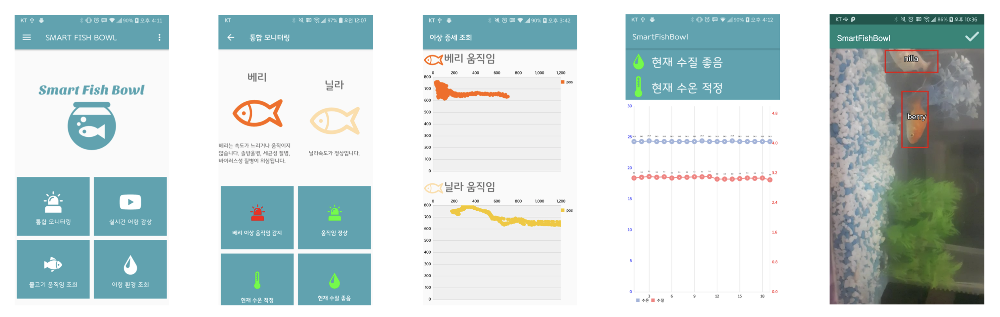

# 영상처리를 이용한 물고기 이상 증세 관리 어항

 

## 1. 구현 기간 
2019.02-2019.08

 

## 2. 개발 배경
* 물고기를 양육하는 사람들이 늘어남
* 물고기를 편리하게 관리할 수 있는 장치의 필요성 증가함

 

## 3. 프로젝트 소개
* 라즈베리파이 카메라를 이용하여 물고기를 촬영하고 OpenCV를 이용하여 물고기를 인식한다.
* 인식한 물고기의 좌표를 도출하고, 이를 통해 물고기의 속도를 계산한다.
* 물고기가 수면 위에 있거나 평균 속도보다 너무 빠르거나 못 미칠 경우에 모바일 애플리케이션에 알림을 보낸다.
* 모바일 애플리케이션을 통해 물고기의 상태와 어항 환경 정보를 확인하고 질병을 예방할 수 있는 어항을 설계한다.

 

## 4. 개발 기술
* 어항
  - 아두이노
  - 수온 센서
  - 혼탁도 센서
* 라즈베리파이
  - 카메라 
  - PHP(웹 서버), Linux, MySQL
  - Python(객체 인식, 데이터 처리)
* 안드로이드 
  - Java
  - MPAndroidChart(그래프 라이브러리)
  - VCL라이브러리(웹뷰를 통해 스트리밍)
  
 

## 5. 담당 업무
  * 장소현(팀장)
    - PHP를 이용해서 웹 서버 및 데이터베이스 구축
    - HTTP와 json을 이용하여 애플리케이션에 데이터 전송
    - 물고기의 속도 및 좌표 데이터를 이용하여 이상 증세 확인 및 시간대별로 움직임을 파악하여 알림 전송
    - 애플리케이션에서 각각의 데이터에 따라 의심스러운 이상 증세 출력

 

## 6. 주요 기능
* 어항
  - 수온 제어 기능
  
* 라즈베리파이
  - 객체 설정 및 추적 기능
  - 어항 모니터링
  
* 안드로이드  
  - 실시간 어항 감상
  - 물고기의 통합 모니터링(물고기의 움직임, 수온, 수질 등)
  - 물고기의 움직임 조회(그래프)
  - 어항 환경 조회(그래프)
  - 시간대 별 물고기 상태 변화 알림 

 

## 7. 파일
* data-management_python(Raspberry pi)
  - checkValue.py
    - calculate average of velocity, object location etc.. and send push notification to android in time
  - getArduinoData.py
      - get arduino data and save data to database
  - saveModel.py
      - save sample data to database

* object-tracking-with-dlib(Window 10)
  - get_points.py
  - nilamoving.mp4
  - object-tracker-multiple.py
    - python object-tracker-multiple.py -v nillamoving.mp4
    - In raspberry with pi camera, if you want to use it with streaming, change "-v nillamoving.mp4" to "http://localhost:8081" this uses 'motion streaming'.. "sudo apt-get install motion"
    - object tracking with dlib
    - calculate velocity, center of object
    - save data in Database
    - check multi object id

* php(Web Server)
  - captureImage.php 
  - fishInput.php
  - fishXY_0.php
  - fishXY_1.php 
  - nowStateLoc.php 
  - nowStateVelo.php
  - sensorDB.php 

 

## 8. 결과물

  
 
